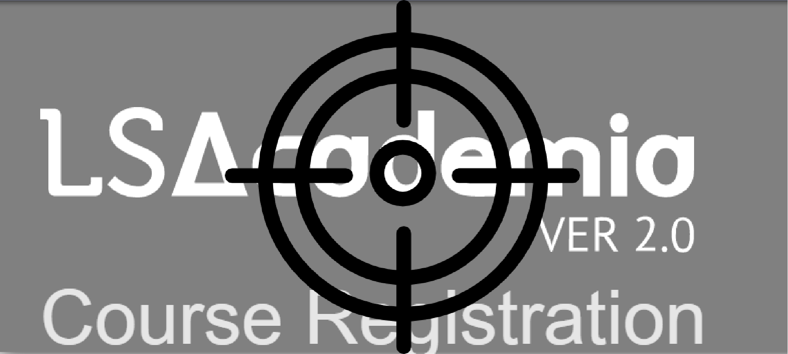

<h1 align="center">
  
   
</h1>

An easy to use and reliable script/bot to automatically register subject from DTU portal in background

## The problem (Outline)

DTU has a portal hosted on LSAcademia, and every semester students have to register their subjects. The portal is on first come first serve basis, but due to high traffic, the portal hardly works wasting a lot of time for students to register their subjects. Even despite that, not everyone gets the required subjects. And there is a lot trading of subjects going on, the one who are able to access the portal block subjects and later demand for other subjects or at times money.

## This solution

This LSAttacked (script) offer a simple yet reliable and easy solution to register subjects from the portal without have to even open the portal once. Just setup the LSAttacked (script) before the registration begins. Add in your credentials and the subjects codes that you need to register and let the LSAttacked (script) run in background.

## Disclaimer

This LSAttacked (script) is just made for educational and experimental purposes and is intended for registration purposes only. PLease adhere to the following points
- Any actions and or activities related to the material contained within this LSAttacked (script) is solely your responsibility. In case of misuse of the LSAttacked (script)  the authors and contributors or any other person maintaining the repo will not be held responsible in the event any kind of misuse of the LSAttacked (script).
- Do not attempt to violate the law with anything contained here. If you  planned to use the content for illegal purpose, then please leave this site immediately! We will not be responsible for your any illegal actions. Neither administration of this website, the authors of this material, or anyone else affiliated in any way, is going to accept responsibility for your actions.

### LSAttacked

This is an easy to use and reliable script to automatically register subjects from the DTU registration portal, it uses selenium for the automation purposes.

> NOTE: This has been tested and improved over the years and am making it public now for others to use.

## Table of Contents

- [Demo](#demo)
- [Installation](#installation)
- [Usage](#usage)
- [Packages and Libraries](#packages-and-libraries)
- [Future Scope](#future-scope)
- [Contributors](#contributors)
- [LICENSE](#license)

## Demo

Below is a Gif demonstrating the app and it's various features that are available for the users to try out.

## Installation

This script is based on [Python][python] and requires python (preferably python3) to be installed and uses [Google Chrome][google-chrome](preferably latest version) for automation.

On top of that the script works on [selenium][selenium] and that needs to installed via pip. Refer the [usage](#Usage) section for more information.

To execute the chrome automation, one would also need to [chrome-webdriver][chrome-webdriver] placed in the current directory. Make sure to download the chrome-webdriver with same version as of your [Google Chrome][google-chrome] installation. Windows users refer the [Windows](#win) section.

## Usage

This script would require [python][python] and [Google Chrome][google-chrome] to be installed.

After that platform specific guide is given.

### Windows

- To check the version of your Chrome, run the [chrome_version.bat](./windows_setup/chrome_version.bat) file.
- To download Chrome Webdriver, run [download_chrome_webdriver.bat](./windows_setup/download_chrome_webdriver.bat) file and download the webdriver matching your chrome version and replace it in the current directory.
- Update the information in the [credentials.txt](./credentials.txt) file.
 The file line contains the roll no.(2Kxx/xx/xxx) while the next line contains the password.
- Update the Course Information in the [subjects.txt](./subjects.txt) file.
 Each Line contains the subject code that the script needs to execute. 
- Run the [run.bat](run.bat) file

### Linux 
- Install selenium using the following command
  
  > pip install -r requirements.txt
- Download the Chrome Webdriver from https://chromedriver.chromium.org/downloads from your version of Google Chrome and replace it to the current directory.
- Update the information in the [credentials.txt](./credentials.txt) file.
 The file line contains the roll no.(2Kxx/xx/xxx) while the next line contains the password.
- Update the Course Information in the [subjects.txt](./subjects.txt) file.
 Each Line contains the subject code that the script needs to execute. 
- Install selenium using the following command
  
  > python LSAttacked.py

> Note: For advanced users you can edit the param file and also try out improving the script by exploring the [LSAttacked.ipynb](./LSAttacked.ipynb) file.

## Packages and libraries Used

Below is a list of all the Packages and libraries used for making the script.

### [Selenium][selenium] - `4.6.0`

Used for the purpose of automation.

### [Time][time] - `3.6`

This package provides with sleep and current time.

### [Logging][logging] - `0.4.9.6`

Used for logging purpose. The logs can be found in [logs folder](./logs/)

## Contributors

Thanks goes to these people:

<!-- ALL-CONTRIBUTORS-LIST:START - Do not remove or modify this section -->

<!-- prettier-ignore-start -->

<!-- markdownlint-disable -->

<table>
  <tr>
    <td align="center"><a href="https://www.github.com/theincrediblevee"> <b>TheIncredibleVee</b></a> <a href="https://github.com/sqlized/commits?author=theincrediblevee" title="Code">💻</a> <a href="" title="Reviewed Pull Requests">👀</a><a href="#example-kentcdodds" title="Examples">💡</a> </td>
</tr>
</table>

Contributions of any kind are welcome!

## LICENSE

MIT

[google-chrome]: https://support.google.com/chrome/answer/95346?hl=en&co=GENIE.Platform%3DDesktop
[python]: https://www.python.org/downloads/
[logging]: https://docs.python.org/3/howto/logging.html/
[Selenium]: https://www.selenium.dev/documentation/
[time]: https://docs.python.org/3/library/time.html/
[theincrediblevee]: https://www.theincrediblevee.com/